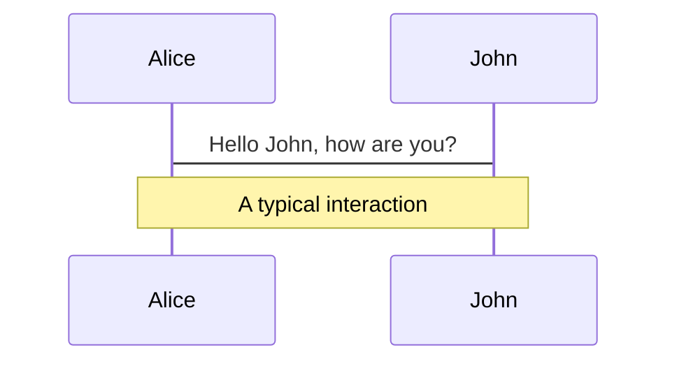
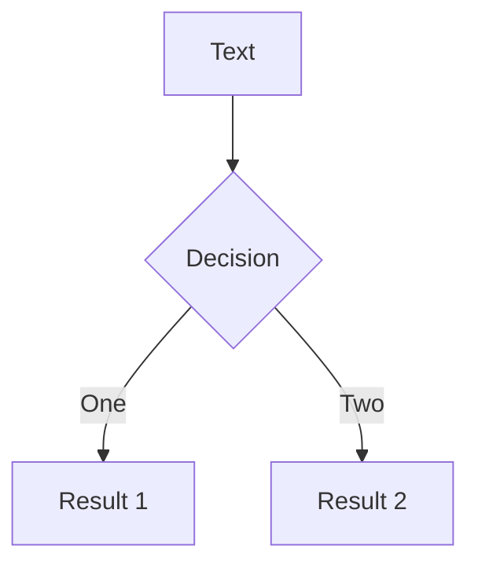
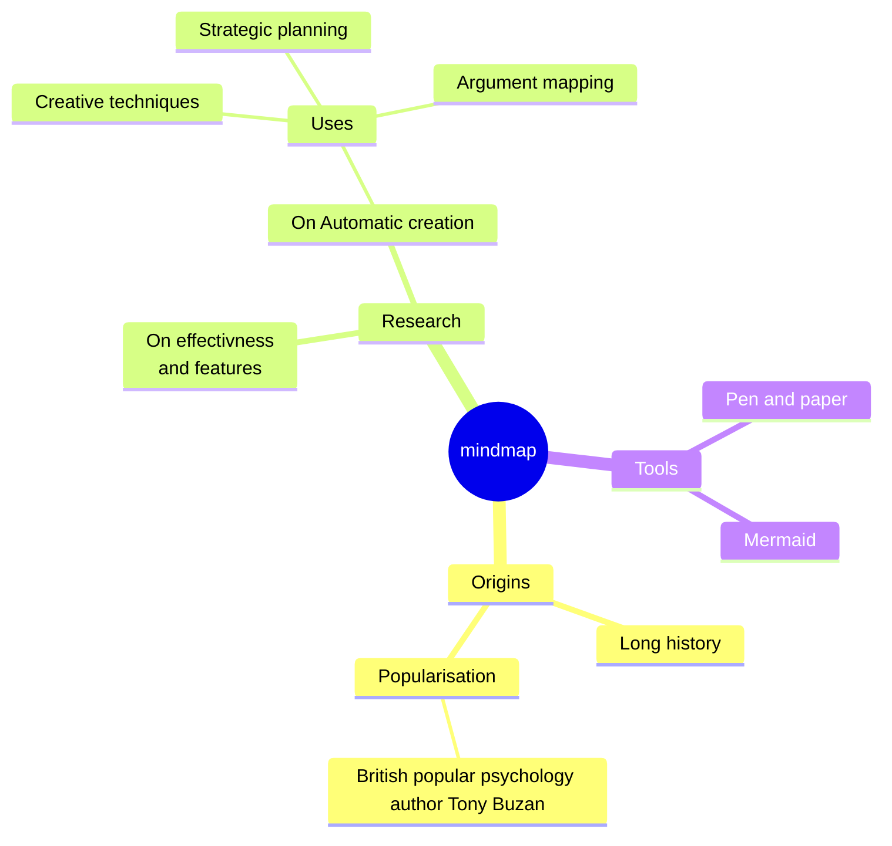
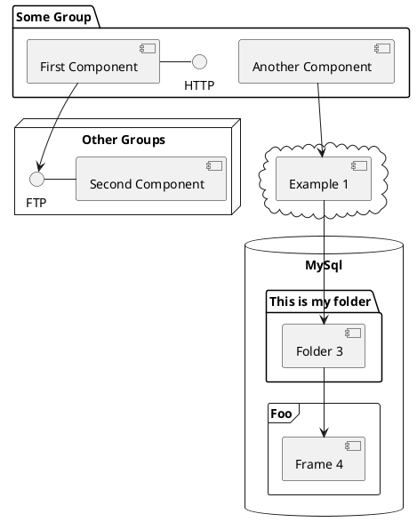

---
# try also 'default' to start simple
theme: default
# random image from a curated Unsplash collection by Anthony
# like them? see https://unsplash.com/collections/94734566/slidev
background: https://images.unsplash.com/photo-1589656966895-2f33e7653819?q=80&w=3870&auto=format&fit=crop&ixlib=rb-4.0.3&ixid=M3wxMjA3fDB8MHxwaG90by1wYWdlfHx8fGVufDB8fHx8fA%3D%3D
# apply any unocss classes to the current slide
class: 'text-center'
# https://sli.dev/custom/highlighters.html
highlighter: shiki
# some information about the slides, markdown enabled
info: |
  ## Slidev Starter Template
  Presentation slides for developers.
exportFilename: 'vuejs-nation-2023-lightning-talk-polite-popup'
download: true
#   Learn more at [Sli.dev](https://sli.dev)
transition: slide-left
title: Polars Sharing
hideInToc: true # whether it gets hidden in table of content
mdc: true

---

# Technical Sharing

## Polars: An optimized DataFrame library

<div class="pt-12">
  <span @click="$slidev.nav.next" class="px-2 py-1 rounded cursor-pointer" hover="bg-white bg-opacity-10">
    Press Space for next page <carbon:arrow-right class="inline"/>
  </span>
</div>

<div class="abs-br m-6 flex gap-2">
  <button @click="$slidev.nav.openInEditor()" title="Open in Editor" class="text-xl slidev-icon-btn opacity-50 !border-none !hover:text-white">
    <carbon:edit />
  </button>
  <a href="https://github.com/slidevjs/slidev" target="_blank" alt="GitHub" title="Open in GitHub"
    class="text-xl slidev-icon-btn opacity-50 !border-none !hover:text-white">
    <carbon-logo-github />
  </a>
</div>

<br>
<br>
<br>

Read more about Polars at [Polars User Guide](https://docs.pola.rs/)

---
layout: default
hideInToc: true
transition: fade-out
---


# Table of contents

<Toc maxDepth="1"></Toc>

<style>
h1 {
  background-color: #2B90B6;
  background-image: linear-gradient(45deg, #4EC5D4 10%, #146b8c 20%);
  background-size: 100%;
  -webkit-background-clip: text;
  -moz-background-clip: text;
  -webkit-text-fill-color: transparent;
  -moz-text-fill-color: transparent;
}
</style>

---
transition: fade-out
---

# What is Polars?

Polars is a Pandas alternative designed to process data faster. The core is written in Rust, and available for Python, R and NodeJS
<div
  v-if="$slidev.nav.currentPage === 3"
  v-motion
  :initial="{ x: -100, opacity: 0}"
  :enter="{ x: 0, opacity: 1, scale: 1, transition: { delay: 100, duration: 1300 } }"
>

- 💻 Utilizes all the available cores on your machine
- 🏃 Optimizes queries to reduce unneeded work/memory allocations.
- 📚 Handles datasets much larger than your available RAM
- 📖 A consistent and predictable API
- 🔒 Adheres to a strict schema (data-types should be known before running the query).

</div>
<br>
<br>


<style>
h1 {
  background-color: #2B90B6;
  background-image: linear-gradient(45deg, #4EC5D4 10%, #146b8c 20%);
  background-size: 100%;
  -webkit-background-clip: text;
  -moz-background-clip: text;
  -webkit-text-fill-color: transparent;
  -moz-text-fill-color: transparent;
}
</style>


---
transition: slide-up
level: 2
---

# Arrow
Polars builds on top of the Apache Arrow Project.
<div grid="~ cols-2 gap-4">
<div>

**Advantages of Arrow:**

- Columnar format enables data adjacency for sequential access or scans

- Contiguous columnar layout is vectorization-friendly and allows SIMD(Sinlge Instruction, Multiple Data) operations 
</div>

<div>
  
</div>
</div>


<style>
h1 {
  background-color: #2B90B6;
  background-image: linear-gradient(45deg, #4EC5D4 10%, #146b8c 20%);
  background-size: 100%;
  -webkit-background-clip: text;
  -moz-background-clip: text;
  -webkit-text-fill-color: transparent;
  -moz-text-fill-color: transparent;
}
</style>

---
transition: slide-left
level: 2
---

# Polars' lazy execution
Handling larger than RAM datasets


<style>
h1 {
  background-color: #2B90B6;
  background-image: linear-gradient(45deg, #4EC5D4 10%, #146b8c 20%);
  background-size: 100%;
  -webkit-background-clip: text;
  -moz-background-clip: text;
  -webkit-text-fill-color: transparent;
  -moz-text-fill-color: transparent;
}
</style>

---
transition: fade-in
---


# 7 Verbs that get most jobs done
Most common operations for data manipulation
<div grid="~ cols-2 gap-4">
<div>

<ul>
  <li v-click>Select / Slice columns</li>
  <li v-click>Create / Transform / Assign columns</li>
  <li v-click>Filter / Slice / Query rows</li>
  <li v-click>Join / Merge another dataframe</li>
  <li v-click>Group by</li>
  <li v-click>Aggregate</li>
  <li v-click>Sort</li>
</ul>

</div>
<div>

```html
<Tweet id="1390115482657726468" />
```

<Tweet id="1390115482657726468" scale="0.65" />

</div>
</div>

<style>
h1 {
  background-color: #2B90B6;
  background-image: linear-gradient(45deg, #4EC5D4 10%, #146b8c 20%);
  background-size: 100%;
  -webkit-background-clip: text;
  -moz-background-clip: text;
  -webkit-text-fill-color: transparent;
  -moz-text-fill-color: transparent;
}
</style>

---

# Similarities and Differences with Pandas

The following code snippets show the minor differences in syntax for the same operations

<div grid="~ cols-2 gap-4">
  <div>

```python{all|2-5|6|7|8-12|13|14|all}
output = (
    df.assign(
        year= lambda x: x['datetimes'].dt.year,
        month= lambda x: x['datetimes'].dt.month
    )
    .query("year==2022") # .loc
    .merge(subset_df, on='complex_strings', how='inner')
    .groupby('categories', as_index=False)
    .agg(
        sum_integers=('integers', 'sum'),
        mean_floats=('floats', 'mean')
    )
    .loc[lambda x: x['mean_floats'] == x['mean_floats'].max()]
    .filter(items = ['categories']) # .loc
)
```
</div>

<div>
```python{all|2-5|6|7|8-12|13|14|all}
output = (
    df_polars.with_columns(
        [pl.col('datetimes').dt.year().alias('year'),
         pl.col('datetimes').dt.month().alias('month')]
    )
    .filter(pl.col('year') == 2022)
    .join(subset_df_polars, on='complex_strings', how='inner')
    .group_by('categories')
    .agg(
        pl.col('integers').sum().alias('sum_integers'),
        pl.col('floats').mean().alias('mean_floats'),
    )
    .filter(pl.col('mean_floats') == pl.col('mean_floats').max())
    .select(['categories'])
)
```
</div>
</div>

<style>
h1 {
  background-color: #2B90B6;
  background-image: linear-gradient(45deg, #4EC5D4 10%, #146b8c 20%);
  background-size: 100%;
  -webkit-background-clip: text;
  -moz-background-clip: text;
  -webkit-text-fill-color: transparent;
  -moz-text-fill-color: transparent;
}
</style>

---
layout: image-right
image: /imgs/1*En6dg0dOK7Nwst9Mdp-VPw.webp
---

# Benchmarking

Pandas VS Polars with a 1-million rows dataset

- Read & Write
- Sorting
- Groupby & Aggregation
- String Manipulation
- Filtering Rows
- Join Operations

<style>
h1 {
  background-color: #2B90B6;
  background-image: linear-gradient(45deg, #4EC5D4 10%, #146b8c 20%);
  background-size: 100%;
  -webkit-background-clip: text;
  -moz-background-clip: text;
  -webkit-text-fill-color: transparent;
  -moz-text-fill-color: transparent;
}
</style>

---
class: px-20
---

# When is Polars or Pandas Preferred?

Slidev comes with powerful theming support. Themes can provide styles, layouts, components, or even configurations for tools. Switch between themes on a per-slide basis with just **one change** in your frontmatter:

<div grid="~ cols-2 gap-2" m="t-2">

```yaml
---
theme: default
---
```

```yaml
---
theme: seriph
---
```


</div>

Read more about [How to use a theme](https://sli.dev/themes/use.html) and
check out the [Awesome Themes Gallery](https://sli.dev/themes/gallery.html).


---

# LaTeX

LaTeX is supported out-of-box powered by [KaTeX](https://katex.org/).

<br>

Inline $\sqrt{3x-1}+(1+x)^2$

Block
$$ {1|3|all}
\begin{array}{c}

\nabla \times \vec{\mathbf{B}} -\, \frac1c\, \frac{\partial\vec{\mathbf{E}}}{\partial t} &
= \frac{4\pi}{c}\vec{\mathbf{j}}    \nabla \cdot \vec{\mathbf{E}} & = 4 \pi \rho \\

\nabla \times \vec{\mathbf{E}}\, +\, \frac1c\, \frac{\partial\vec{\mathbf{B}}}{\partial t} & = \vec{\mathbf{0}} \\

\nabla \cdot \vec{\mathbf{B}} & = 0

\end{array}
$$

<br>

[Learn more](https://sli.dev/guide/syntax#latex)

---

# Diagrams

You can create diagrams / graphs from textual descriptions, directly in your Markdown.

<div class="grid grid-cols-4 gap-5 pt-4 -mb-6">









</div>

[Learn More](https://sli.dev/guide/syntax.html#diagrams)

---
layout: center
class: text-center
---

# Learn More

[Documentation](https://sli.dev) · [GitHub](https://github.com/slidevjs/slidev) · [Showcases](https://sli.dev/showcases.html)
