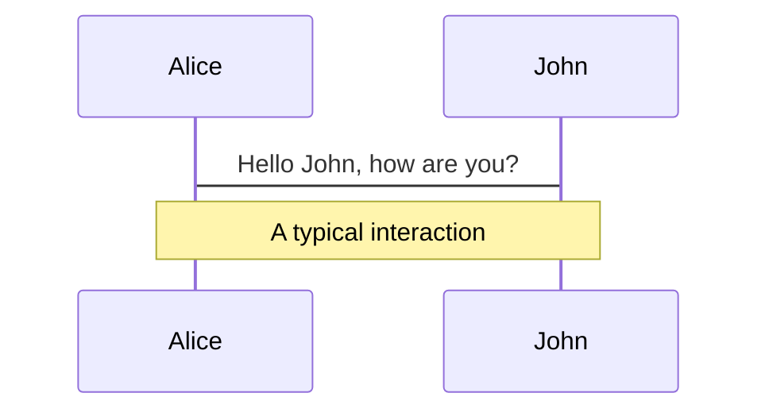
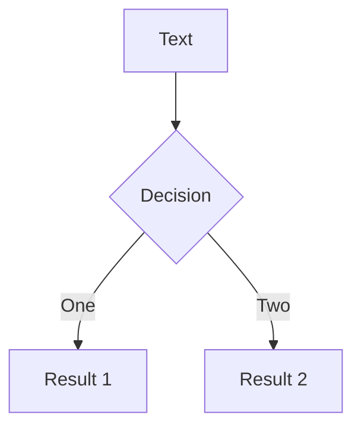
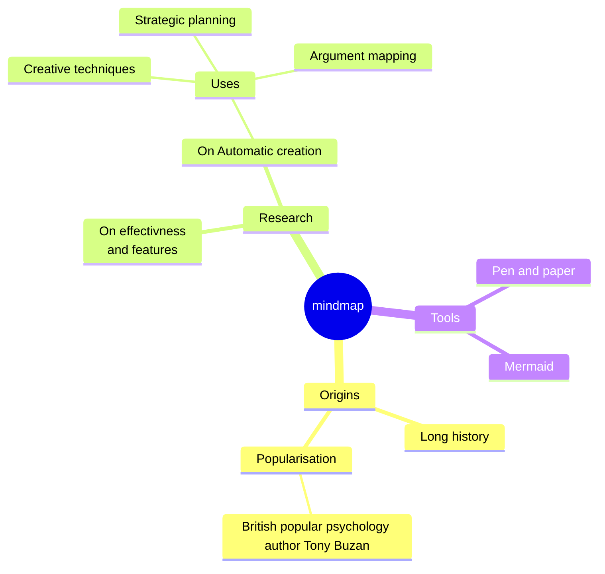
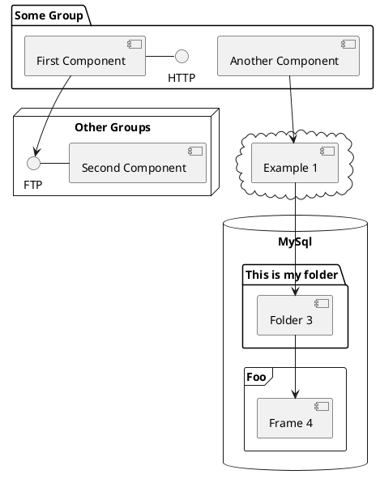

---
# try also 'default' to start simple
theme: default
# random image from a curated Unsplash collection by Anthony
# like them? see https://unsplash.com/collections/94734566/slidev
background: https://images.unsplash.com/photo-1589656966895-2f33e7653819?q=80&w=3870&auto=format&fit=crop&ixlib=rb-4.0.3&ixid=M3wxMjA3fDB8MHxwaG90by1wYWdlfHx8fGVufDB8fHx8fA%3D%3D
# apply any unocss classes to the current slide
class: 'text-center'
# https://sli.dev/custom/highlighters.html
highlighter: shiki
# some information about the slides, markdown enabled
info: |
  ## Slidev Starter Template
  Presentation slides for developers.
exportFilename: 'vuejs-nation-2023-lightning-talk-polite-popup'
download: true
#   Learn more at [Sli.dev](https://sli.dev)
transition: slide-left
title: Polars Sharing
hideInToc: true # whether it gets hidden in table of content
mdc: true

---

# Technical Sharing

## Polars: An optimized DataFrame library

<div class="pt-12">
  <span @click="$slidev.nav.next" class="px-2 py-1 rounded cursor-pointer" hover="bg-white bg-opacity-10">
    Press Space for next page <carbon:arrow-right class="inline"/>
  </span>
</div>

<div class="abs-br m-6 flex gap-2">
  <button @click="$slidev.nav.openInEditor()" title="Open in Editor" class="text-xl slidev-icon-btn opacity-50 !border-none !hover:text-white">
    <carbon:edit />
  </button>
  <a href="https://github.com/slidevjs/slidev" target="_blank" alt="GitHub" title="Open in GitHub"
    class="text-xl slidev-icon-btn opacity-50 !border-none !hover:text-white">
    <carbon-logo-github />
  </a>
</div>

<br>
<br>
<br>

Read more about Polars at [Polars User Guide](https://docs.pola.rs/)

---
layout: default
hideInToc: true
transition: fade-out
---


# Table of contents

<Toc maxDepth="1"></Toc>

<style>
h1 {
  background-color: #2B90B6;
  background-image: linear-gradient(45deg, #4EC5D4 10%, #146b8c 20%);
  background-size: 100%;
  -webkit-background-clip: text;
  -moz-background-clip: text;
  -webkit-text-fill-color: transparent;
  -moz-text-fill-color: transparent;
}
</style>

---
transition: fade-out
---

# What is Polars?

A Pandas alternative with different design philosopy.
<div
  v-if="$slidev.nav.currentPage === 3"
  v-motion
  :initial="{ x: -100, opacity: 0}"
  :enter="{ x: 0, opacity: 1, scale: 1, transition: { delay: 100, duration: 1300 } }"
>

- 💻 Utilizes all the available cores on your machine
- 🏃 Optimizes queries to reduce unneeded work/memory allocations.
- 📚 Handles datasets much larger than your available RAM
- 📖 A consistent and predictable API
- 🔒 Adheres to a strict schema (data-types should be known before running the query).
- Uses method chaining by default (elegance and readability)
- Dropped the concept of indexing

</div>
<br>
<br>


<style>
h1 {
  background-color: #2B90B6;
  background-image: linear-gradient(45deg, #4EC5D4 10%, #146b8c 20%);
  background-size: 100%;
  -webkit-background-clip: text;
  -moz-background-clip: text;
  -webkit-text-fill-color: transparent;
  -moz-text-fill-color: transparent;
}
</style>


---
transition: slide-up
---

# Arrow Columnar Format
Polars builds on top of the Apache Arrow Project.
<div grid="~ cols-2 gap-4">
<div>

**Advantages of Arrow:**

- Data adjacency for sequential access (scans)
- O(1) (constant-time) random access
- SIMD and vectorization-friendly
- Relocatable without “pointer swizzling”, allowing for true zero-copy access in shared memory


**Remark:**

Pandas 2.0 has integration with Arrow but it is <u>more for storage</u>, computational potential is yet exploited across all Pandas operations.
[Reference](https://datapythonista.me/blog/pandas-20-and-the-arrow-revolution-part-i)

</div>

<div>
  
</div>
</div>


<style>
h1 {
  background-color: #2B90B6;
  background-image: linear-gradient(45deg, #4EC5D4 10%, #146b8c 20%);
  background-size: 100%;
  -webkit-background-clip: text;
  -moz-background-clip: text;
  -webkit-text-fill-color: transparent;
  -moz-text-fill-color: transparent;
}
</style>

---
transition: slide-up
---

# How to survive without Index?
Polars does not have the equivalent of `.loc` or `.iloc` in Pandas

- The readability of `df.loc[pd.IndexSlice[:, 'B0':'B1'], :]]` can be dubious
- `reset_index(drop=True)` can be troublesome
- You can still use `[]` to get rows and columns but the recommended way is to use `.select` or `.filter`

<br>

Code snippet:
```python{*}{maxHeight:'250px'}
# Rows by number and columns by name

# The recommended ways
df_pl.select(["integers", "categories"]).head(16).tail(4)

df_pl.select(pl.col(["integers", "categories"]).gather(list(range(12, 16))))

# You can still do this but it is not recommended (Type error in lazy execution)
df_pl[12:16, ["integers", "categories"]]


# Rows by string index, columns by name
(
    df_pl.filter(pl.col("strings").str.contains("NJ"))
    .select(['integers', 'floats', 'strings'])
)

# Both rows and columns by number
df_pl[[0, 1, 3], [0, 1]]
```

<style>
h1 {
  background-color: #2B90B6;
  background-image: linear-gradient(45deg, #4EC5D4 10%, #146b8c 20%);
  background-size: 100%;
  -webkit-background-clip: text;
  -moz-background-clip: text;
  -webkit-text-fill-color: transparent;
  -moz-text-fill-color: transparent;
}
</style>


---
transition: slide-left
---

# Lazy Execution (1)
Only materialize the dataset in memory when necessary, based on the operations that have been queued

```python {*}{maxHeight:'250px'}
def random_dates(start, end, n):
    start_u = start.value//10**9
    end_u = end.value//10**9
    return pd.to_datetime(np.random.randint(start_u, end_u, n), unit='s')

def generate_dataframe(num_rows):
    # Generate data
    int_data = np.random.randint(1, 100, size=num_rows)
    float_data = np.random.uniform(1.0, 100.0, size=num_rows)
    string_data = [''.join(random.choices('ABCDEFGHIJKLMNOPQRSTUVWXYZ', k=5)) for _ in range(num_rows)]
    datetime_data = random_dates(pd.to_datetime('2020-01-01'), pd.to_datetime('2023-01-01'), num_rows)
    boolean_data = np.random.choice([True, False], size=num_rows)
    category_data = pd.Categorical(np.random.choice(['A', 'B', 'C', 'D'], size=num_rows))
    complex_string_data = ['user_' + ''.join(random.choices('0123456789', k=4)) for _ in range(num_rows)]
    # Another integer column
    another_int_data = np.random.randint(100, 200, size=num_rows)
    # Another float column with a different range
    another_float_data = np.random.uniform(100.0, 200.0, size=num_rows)

    # Create DataFrame using Pandas eager execution
    df = pd.DataFrame({
        'integers': int_data,
        'floats': float_data,
        'strings': string_data,
        'datetimes': datetime_data,
        'booleans': boolean_data,
        'categories': category_data,
        'complex_strings': complex_string_data,
        'more_integers': another_int_data,
        'more_floats': another_float_data,
    })
    
    return df

# Example usage
df = generate_dataframe(1_000_000_00)

# The eager execution in Pandas here can cause the kernel to crash if your machine is not powerful enough


# Replace the dataframe generation using Polars LazyFrame syntax

    df = pl.LazyFrame({
          'integers': int_data,
          'floats': float_data,
          'strings': string_data,
          'datetimes': datetime_data,
          'booleans': boolean_data,
          'categories': category_data,
          'complex_strings': complex_string_data,
          'more_integers': another_int_data,
          'more_floats': another_float_data,
      })
    
    return df

# Cache it (.collect()) only if you want to materialize the data
df_polars_lazy = generate_dataframe_polars(1_000_000)
```
<br>

Remark: By reducing the <span style="background-color: yellow; color: black;">frequency of materialization</span>, you minimize the number of times data is physically shuffled, sorted, or aggregated across the network or disk, which can be very time-consuming


<style>
h1 {
  background-color: #2B90B6;
  background-image: linear-gradient(45deg, #4EC5D4 10%, #146b8c 20%);
  background-size: 100%;
  -webkit-background-clip: text;
  -moz-background-clip: text;
  -webkit-text-fill-color: transparent;
  -moz-text-fill-color: transparent;
}
</style>

---
transition: fade-out
---

# Lazy Execution (2)
Streaming mode, usually compared to Dask instead of Pandas. Still under construction

Use Case: If data is continuously generated and needs immediate processing

Sample code:
```python
pl.enable_string_cache()
occupation_counts_pl = (
    pl.scan_parquet(fec_dir / "indiv*.pq", cache=False)
    .select(pl.col("OCCUPATION").value_counts(parallel=True, sort=True))
    .collect(streaming=True)
)
occupation_counts_pl
```
<br>

[Reference](https://kevinheavey.github.io/modern-polars/scaling.html)


<style>
h1 {
  background-color: #2B90B6;
  background-image: linear-gradient(45deg, #4EC5D4 10%, #146b8c 20%);
  background-size: 100%;
  -webkit-background-clip: text;
  -moz-background-clip: text;
  -webkit-text-fill-color: transparent;
  -moz-text-fill-color: transparent;
}
</style>

---
transition: fade-in
---


# 7 Verbs that get most jobs done
Most common operations for data manipulation
<div grid="~ cols-2 gap-4">
<div>

<ul>
  <li v-click>Select / Slice columns</li>
  <li v-click>Create / Transform / Assign columns</li>
  <li v-click>Filter / Slice / Query rows</li>
  <li v-click>Join / Merge another dataframe</li>
  <li v-click>Group by</li>
  <li v-click>Aggregate</li>
  <li v-click>Sort</li>
</ul>

</div>
<div>


</div>
</div>

<style>
h1 {
  background-color: #2B90B6;
  background-image: linear-gradient(45deg, #4EC5D4 10%, #146b8c 20%);
  background-size: 100%;
  -webkit-background-clip: text;
  -moz-background-clip: text;
  -webkit-text-fill-color: transparent;
  -moz-text-fill-color: transparent;
}
</style>

---

# Similarities and Differences with Pandas

The following code snippets show the minor differences in syntax for the same operations

<div grid="~ cols-2 gap-4">
  <div>

```python{all|2-5|6|7|8-12|13|14|all}
output = (
    df.assign(
        year= lambda x: x['datetimes'].dt.year,
        month= lambda x: x['datetimes'].dt.month
    )
    .query("year==2022") # .loc
    .merge(subset_df, on='complex_strings', how='inner')
    .groupby('categories', as_index=False)
    .agg(
        sum_integers=('integers', 'sum'),
        mean_floats=('floats', 'mean')
    )
    .loc[lambda x: x['mean_floats'] == x['mean_floats'].max()]
    .filter(items = ['categories']) # .loc
)
```
</div>

<div>
```python{all|2-5|6|7|8-12|13|14|all}
output = (
    df_polars.with_columns(
        [pl.col('datetimes').dt.year().alias('year'),
         pl.col('datetimes').dt.month().alias('month')]
    )
    .filter(pl.col('year') == 2022)
    .join(subset_df_polars, on='complex_strings', how='inner')
    .group_by('categories')
    .agg(
        pl.col('integers').sum().alias('sum_integers'),
        pl.col('floats').mean().alias('mean_floats'),
    )
    .filter(pl.col('mean_floats') == pl.col('mean_floats').max())
    .select(['categories'])
)
```
</div>
</div>

<style>
h1 {
  background-color: #2B90B6;
  background-image: linear-gradient(45deg, #4EC5D4 10%, #146b8c 20%);
  background-size: 100%;
  -webkit-background-clip: text;
  -moz-background-clip: text;
  -webkit-text-fill-color: transparent;
  -moz-text-fill-color: transparent;
}
</style>

---
layout: image-right
image: /imgs/pandas_vs_polars.png
---

# Interoprability with other Python Libraries

- Numpy
- ML

<style>
h1 {
  background-color: #2B90B6;
  background-image: linear-gradient(45deg, #4EC5D4 10%, #146b8c 20%);
  background-size: 100%;
  -webkit-background-clip: text;
  -moz-background-clip: text;
  -webkit-text-fill-color: transparent;
  -moz-text-fill-color: transparent;
}
</style>

---
class: px-20
---

# When is Polars or Pandas Preferred?

Slidev comes with powerful theming support. Themes can provide styles, layouts, components, or even configurations for tools. Switch between themes on a per-slide basis with just **one change** in your frontmatter:

<div grid="~ cols-2 gap-2" m="t-2">

```yaml
---
theme: default
---
```

```yaml
---
theme: seriph
---
```


</div>

Read more about [How to use a theme](https://sli.dev/themes/use.html) and
check out the [Awesome Themes Gallery](https://sli.dev/themes/gallery.html).


---

# Additional Performance tips

Some fairly obvious performance rules

- Use the lazy API.
- Use Exprs, and don’t use .apply unless you really have to.
- Use the smallest necessary numeric types (so if you have an integer between 0 and 255, use pl.UInt8, not pl.Int64). This will save both time and space.
- Use efficient storage (if you’re dumping stuff in files, Parquet is a good choice).
- Use categoricals for recurring strings (but note that it may not be worth it if there’s not much repetition).
- Only select the columns you need.


---

# Other Useful Resources

You can create diagrams / graphs from textual descriptions, directly in your Markdown.

<div class="grid grid-cols-4 gap-5 pt-4 -mb-6">









</div>

[Learn More](https://sli.dev/guide/syntax.html#diagrams)

---
layout: center
class: text-center
---

# Learn More

[Documentation](https://sli.dev) · [GitHub](https://github.com/slidevjs/slidev) · [Showcases](https://sli.dev/showcases.html)
